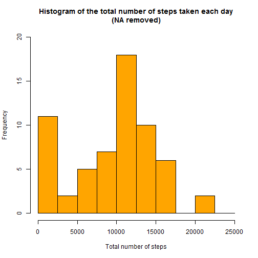
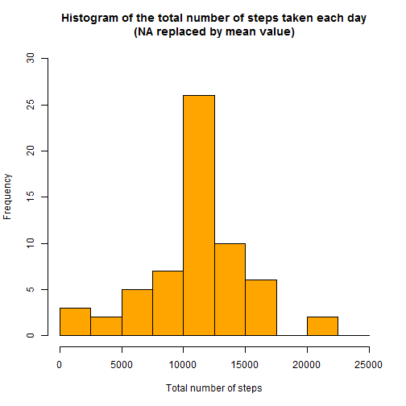
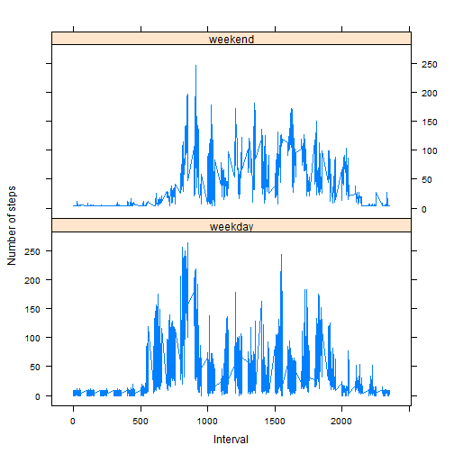

**Q1:Loading and preprocessing the data**
=======================================

**Step 1 : Load in the data**


```r
df <- read.csv("activity.csv")
```

**Step 2 : Preprocess the data**


```r
# Change the date attribute to an actual date format
df$date <- as.POSIXct(df$date, format="%Y-%m-%d")

# Compute the weekdays from the date attribute
df <- data.frame(date=df$date, 
                           weekday=tolower(weekdays(df$date)), 
                           steps=df$steps, 
                           interval=df$interval)

# Compute the day type (indicate either weekend or weekday)
df <- cbind(df, 
            daytype=ifelse(df$weekday == "saturday" | 
            df$weekday == "sunday", "weekend", 
                                     "weekday"))

# Create the final data frame
activity <- data.frame(date=df$date, 
                       weekday=df$weekday, 
                       daytype=df$daytype, 
                       interval=df$interval,
                       steps=df$steps)
```


**Step 3 : Check the head of the data**


```r
head(activity)
```

```
##         date weekday daytype interval steps
## 1 2012-10-01  monday weekday        0    NA
## 2 2012-10-01  monday weekday        5    NA
## 3 2012-10-01  monday weekday       10    NA
## 4 2012-10-01  monday weekday       15    NA
## 5 2012-10-01  monday weekday       20    NA
## 6 2012-10-01  monday weekday       25    NA
```


```r
# Clear the workspace
rm(df)
```

**Q2: What is mean total number of steps taken per day?**
======================================================


**Step 1 : Calculate the total number of steps taken per day**


```r
# Compute the total number of steps each day (NA values removed)
sum_data <- aggregate(activity$steps, by=list(activity$date), FUN=sum, na.rm=TRUE)

# Rename the attributes
names(sum_data) <- c("date", "total")
```

**Step 2 : Create histogram**


```r
hist(sum_data$total, 
     breaks=seq(from=0, to=25000, by=2500),
     col="orange", 
     xlab="Total number of steps", 
     ylim=c(0, 20), 
     main="Histogram of the total number of steps taken each day\n(NA removed)")
```

 

**Step 3 : Calculate the mean of total number of steps per day**


```r
mean_data <-mean(sum_data$total)
```
The mean value of the data is **9354.2295082**

**Step 4 : Calculate the median of total number of steps per day**


```r
med_data <-median(sum_data$total)
```
The mean value of the median is **10395**

**Q3 : What is the average daily activity pattern?**
================================================

**Step 1 : Make the time series plot of 5 minutes interval (x-axis) and the average number of steps taken, averaged across all days (y-axis)** 


```r
# Compute the means of steps accross all days for each interval
mean_data <- aggregate(activity$steps, 
                       by=list(activity$interval), 
                       FUN=mean, 
                       na.rm=TRUE)

# Rename the attributes
names(mean_data) <- c("interval", "mean")

#create time series plot
plot(mean_data$interval, 
     mean_data$mean, 
     type="l", 
     col="blue", 
     lwd=2, 
     xlab="Interval [minutes]", 
     ylab="Average number of steps", 
     main="Time-series of the average number of steps per intervals\n(NA removed)")
```

 

**Step 2 : Find which 5-minute interval, on average across all the days in the dataset, contains the maximum number of steps **


```r
# Find the position of the maximum mean
max_pos <- which(mean_data$mean == max(mean_data$mean))

# Find the value of interval at maximum min position
max_interval <- mean_data[max_pos, 1]
```


```r
# Clear the workspace
rm(max_pos, mean_data)
```


**Q4 : Imputing missing values**
============================
There are a number of days/intervals where there are missing values (coded as NA). The presence of missing days may introduce bias into some calculations or summaries of the data.

**Step 1 :  Identify the number of missing items from the dataframe**


```r
# Clear the workspace
rm(max_interval)
```


```r
#Note that a TRUE boolean value is equivalent to 1 and a FALSE to 0.
NA_count <- sum(is.na(activity$steps))
```

The number of NAs are **2304**

**Step 2 :Devise a strategy for filling in all of the missing values in the dataset. The strategy does not need to be sophisticated. For example, you could use the mean/median for that day, or the mean for that 5-minute interval**


```r
# Find the NA positions
na_pos <- which(is.na(activity$steps))

# Create a vector of means
mean_vec <- rep(mean(activity$steps, na.rm=TRUE), times=length(na_pos))
```
Strategy to replace each NA value is by calculating the mean of the **steps** attribute.

**Step 3 : Create a new dataset that is equal to the original dataset but with the missing data filled in. **


```r
# Replace the NAs by the means
activity[na_pos, "steps"] <- mean_vec

# Clear the workspace
rm(mean_vec, na_pos)

#Displaying the first few rows of new dataset :

head (activity)
```

```
##         date weekday daytype interval   steps
## 1 2012-10-01  monday weekday        0 37.3826
## 2 2012-10-01  monday weekday        5 37.3826
## 3 2012-10-01  monday weekday       10 37.3826
## 4 2012-10-01  monday weekday       15 37.3826
## 5 2012-10-01  monday weekday       20 37.3826
## 6 2012-10-01  monday weekday       25 37.3826
```

**Step 4 : Make a histogram of the total number of steps taken each day and Calculate and report the mean and median total number of steps taken per day. Do these values differ from the estimates from the first part of the assignment? What is the impact of imputing missing data on the estimates of the total daily number of steps? **


```r
# Compute the total number of steps each day (NA values removed)
sum_data <- aggregate(activity$steps, by=list(activity$date), FUN=sum)

# Rename the attributes
names(sum_data) <- c("date", "total")

# Compute the histogram of the total number of steps each day
hist(sum_data$total, 
     breaks=seq(from=0, to=25000, by=2500),
     col="orange", 
     xlab="Total number of steps", 
     ylim=c(0, 30), 
     main="Histogram of the total number of steps taken each day\n(NA replaced by mean value)")
```

 

**Step 6 : Calculate the mean and median**


```r
mean_new<-mean(sum_data$total)
```
The value of mean is **1.0766189 &times; 10<sup>4</sup>**


```r
med_new<-median(sum_data$total)
```
The value of median is **1.0766189 &times; 10<sup>4</sup>**

These values differ greatly from the estimates from the first part of the assignment. The impact of imputing the missing values is to have more data, therefore we obtain bigger value for mean and median.

**Q5 : Are there differences in activity patterns between weekdays and weekends?**
================================================================================

**Step 1: Create a new factor variable in the dataset with two levels - "weekdays" and "weekend" indicating whether a given date is a weekday or weekend day.**


```r
# The new factor variable "daytype" was already in the activity data frame
head(activity)
```

```
##         date weekday daytype interval   steps
## 1 2012-10-01  monday weekday        0 37.3826
## 2 2012-10-01  monday weekday        5 37.3826
## 3 2012-10-01  monday weekday       10 37.3826
## 4 2012-10-01  monday weekday       15 37.3826
## 5 2012-10-01  monday weekday       20 37.3826
## 6 2012-10-01  monday weekday       25 37.3826
```

**Step 2 : Make a panel plot containing a time series plot (i.e. type = "l") of the 5- minute interval (x-axis) and the average number of steps taken, averaged across all weekday days or weekend days (y-axis). **


```r
# Clear the workspace
rm(sum_data)

# Load the lattice graphical library
library(lattice)

# Compute the average number of steps taken, averaged across all daytype variable
mean_data <- aggregate(activity$steps, 
                       by=list(activity$daytype, 
                               activity$weekday, activity$interval), mean)

# Rename the attributes
names(mean_data) <- c("daytype", "weekday", "interval", "mean")

# Display the first few rows of the mean_data data frame:

head(mean_data)
```

```
##   daytype  weekday interval     mean
## 1 weekday   friday        0 8.307244
## 2 weekday   monday        0 9.418355
## 3 weekend saturday        0 4.672825
## 4 weekend   sunday        0 4.672825
## 5 weekday thursday        0 9.375844
## 6 weekday  tuesday        0 0.000000
```
Creating time series plot :


```r
xyplot(mean ~ interval | daytype, mean_data, 
       type="l", 
       lwd=1, 
       xlab="Interval", 
       ylab="Number of steps", 
       layout=c(1,2))
```

 

Based on the time series plots, there are **more activities on the weekdays, compared to the weekend.**

